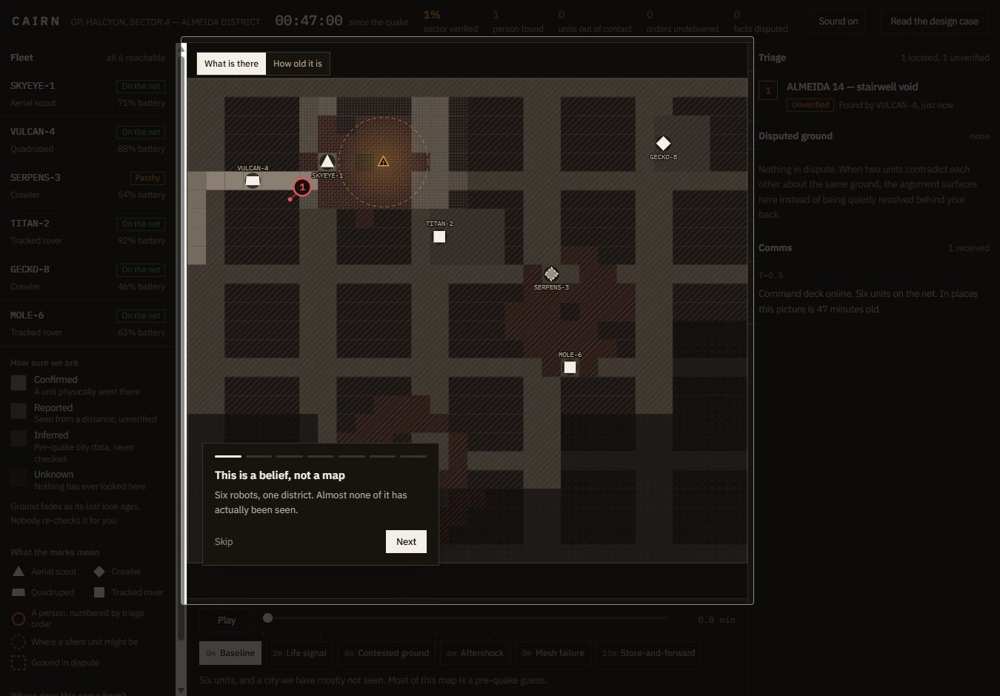
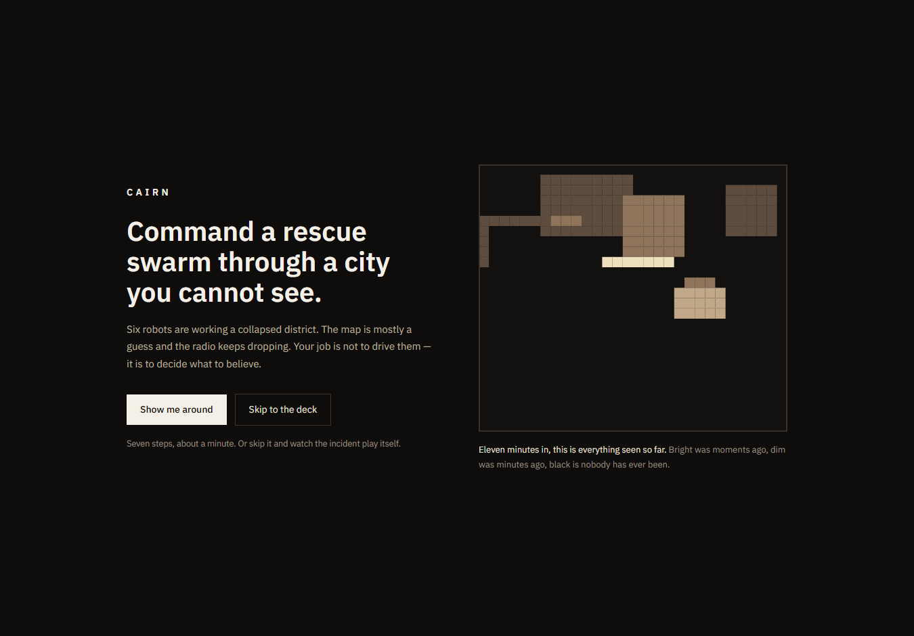

# CAIRN

**Command a rescue swarm through a city you cannot see, using information you cannot fully trust.**

### ▶ [Open the live command deck](https://cairn-showcase.vercel.app)

*Take the one-minute walkthrough, or skip it and watch the incident play itself.*

Mirror: [aaaditt.github.io/cairn](https://aaaditt.github.io/cairn/) — same build, deployed twice so a dead link cannot cost anything.

Built for **UXcelerate!** — the IEI BPDC UI/UX challenge, 5–6 September 2026.

> **This repository is the version that kept going.** The competition entry is frozen exactly as it
> was submitted, at [aaaditt/UXcelerate](https://github.com/aaaditt/UXcelerate)
> ([live](https://cairn-eight-kappa.vercel.app)) — no commit and no redeploy since the deadline.
> Everything added afterwards, the guided walkthrough and the mission audio, lives here instead of
> being backdated onto something already judged.

---

[](https://cairn-showcase.vercel.app)

<sup>**This is not a styling choice.** It is the map switched to *How old it is*, eleven minutes into the incident: every patch of ground six robots have actually observed, and nothing else. Bright was seen seconds ago, dim minutes ago, black never. **81% of the district has never been observed by anything.** An interface that draws the rest as though it were known is lying to the person who has to walk into it.</sup>

---

> *A cairn is what people build to mark a safe route when there is no map.*

## The brief, and the reframe

> Design an interface for coordinating rescue robots after an earthquake, where maps may be incomplete, communication may be unreliable, and robots continuously discover survivors, blocked paths, structural hazards, and new accessible routes.

Read literally, that asks for a fleet dashboard. But every clause in it is about **not knowing things**. So the design question is not "how do we display six robots":

> **The commander's job is not to drive robots. It is to decide what to believe, and where to spend time they do not have.**

CAIRN's primary object is therefore a *decision under uncertainty*, not a fleet. That one move drives every other choice below.

## Four hard problems, four mechanics

| The brief says | CAIRN does |
|---|---|
| **Maps may be incomplete** | Certainty is drawn as **material** — solid, stipple, hatch, void — never as colour alone, so it survives greyscale and colour blindness. And it **decays continuously with age**: ground nobody re-checks fades on screen while you watch, and an aftershock demotes the whole district at once. Certainty is a function of time, not a flag somebody set. |
| **Robots discover contradictions** | When the drone says a street is clear and the rover says it is blocked, the system **refuses to silently pick a winner**. It raises the dispute, attributes both claims with sensor and timestamp, and shows what each answer costs in triage order. |
| **Communication may be unreliable** | A unit that cannot hear us is **never removed from the map**. It holds its last-known position inside a circle that **grows as contact ages**. Orders queue instead of failing, and the fleet counts *"orders this unit does not know about yet."* |
| **Continuous discovery** | Discoveries enter as **candidates to be triaged in**, never as toasts that vanish carrying the only copy of the information. The queue ranks *people*, shows its arithmetic, and states the counterfactual: *"rank 3 → rank 1 if Almeida St is passable."* |

## The idea that makes it work

Every event carries **two clocks**: `t` — when it happened — and `known` — when Command learned it. State is a fold that **filters on `known` but applies events in `t` order**.

```ts
state(T) = EVENTS.filter(e => e.known <= T)   // what Command has received
                 .sort(by e.t)                 // applied in occurrence order
                 .reduce(applyEvent, seed)
```

For a live unit the two clocks are identical. For MOLE-6 — dark at eight minutes, back at eleven — they diverge, and its three minutes of observations arrive **already stale**, slotting into the timeline where they really belong.

**The map gains information about its own past**, and that backfill is what finally settles a dispute raised seven minutes earlier. Store-and-forward, the timeline scrubber, confidence decay, and "what did we know at four minutes" are all the same query with a different bound. This is the rare case where the engineering choice and the design choice are the same choice.

## Why there is no 3D city and no real basemap

The most tempting thing to build here is a photoreal 3D district, or markers dropped onto OpenStreetMap. Both were deliberately rejected, and the reason is the whole argument:

**A photographic basemap asserts that the city is known.** Every road drawn crisply underneath your robots is a claim that somebody has verified it — which is precisely the thing the brief says is not true. The moment you render a pristine street network, you have designed away the problem you were asked to solve.

So the district is hand-drawn SVG over a deterministic simulation. That buys three things a vendor basemap cannot:

1. **Uncertainty becomes drawable.** Confidence *is* the map — the texture, the opacity, the fade. That is not possible when you are compositing on top of somebody else's authoritative tiles.
2. **It cannot fail.** No WebGL context, no tile server, no network dependency in the render path. It draws on a judge's laptop, in a projector room, on a phone.
3. **It is honest about scale.** Six robots, eleven minutes, a few percent of a sector. A slick 3D city makes that look like coverage. A field of black does not.

## Two ways in

**The walkthrough.** Seven steps, one sentence each, spotlit on the real interface with the
incident wound to the moment that makes the point. It replaced three paragraphs of prose on the
entry screen, because showing somebody the disputed-ground panel at the minute two robots start
arguing beats describing it. Skippable from the first frame, and it never runs twice.

**Mission audio.** Every cue is synthesised at runtime — no files, no network, nothing to fail on
a judge's laptop. Sound reports events and never decorates: a rising pair when somebody is found,
two dry knocks when units contradict each other, a low rumble for the aftershock, a falling tone
when a robot stops answering and a climbing one when it comes back. There is no ambience, so
silence genuinely means nothing is happening. One toggle in the top bar turns it off, and the
choice is remembered.

## Walk it in 90 seconds

Six named moments, jumpable from the timeline or with keys `1`–`6`:

| | Moment | What to watch |
|---|---|---|
| **0m** | Baseline | Most of the map is hatched — that is *pre-quake city data*, not ground truth. Sector verified: 1%. |
| **2m** | Life signal | A thermal bloom over Block C enters triage as a **candidate** at 41% confidence. Open it: the ranking shows its arithmetic. |
| **4m** | Contested ground | Air and ground disagree. Read both claims, then decide. The triage order and the map change together. |
| **6m** | Aftershock | M4.6. Every *confirmed* cell in the district is demoted at once. Sector verified drops to **0%**. |
| **8m** | Mesh failure | Two units go dark. Their uncertainty circles grow. Send one anyway — the order **queues**, and the top bar counts it. |
| **11m** | Store-and-forward | MOLE-6 returns with three minutes of the past, stamped `happened at T+9.2`, and it **settles the 4m argument**. |

**Keyboard:** `space` plays and pauses · `1`–`6` jump between moments · `esc` clears the selection · in the walkthrough, `→` advances and `esc` skips
**In-app:** the full written case is behind *Read the design case*, top right.

| | |
|---|---|
|  |  |
| **The walkthrough.** One idea per step, spotlit on the real deck, with the incident wound to the moment that makes the point. | **The way in.** Two buttons, no wall of text — take the tour or go straight to the deck. |

| | |
|---|---|
|  |  |
| **4m — the system refuses to choose.** Both claims attributed with sensor and timestamp. Until it is settled, the ground stays impassable in every route we calculate. | **11m — the past arrives late.** The comms log stamps the backfill `happened at T+9.2`, and evidence from a physical traversal outranks the earlier judgement call. |

## Accessibility — stated honestly

**Lighthouse rates the live build 100 for accessibility, 100 best practices, 100 SEO.** That is a floor, not a certificate — and there is no badge on this repo, because a badge you cannot verify is worse than none.

**Holds up.** No information is carried by colour alone — certainty is texture, triage order is a numeral, link state is a sentence. Body text never drops below 14px, with tabular figures on anything that ticks. Every control is keyboard reachable with a visible focus ring, and `prefers-reduced-motion` is respected.

**Does not.** The SVG map is not keyboard navigable, so per-cell provenance is mouse-only, and there is no live region announcing incident events to a screen reader. Both are written up in [`docs/06-accessibility-audit.md`](docs/06-accessibility-audit.md) rather than hidden.

## Design system in one paragraph

**Colour is a scarce resource.** Real safety-critical equipment — ICU monitors, air traffic displays, INSARAG field kit — is not neon. Here colour only ever means risk or confidence; there is no brand accent, and interactive state is carried by weight, border and a bright neutral instead of hue. When something turns amber on this screen, it means something. An earlier version of this deck had a tracked-out capitalised label above every panel and monospace on every number; it looked technical, but it was decoration pretending to be structure, and it made six panels shout equally. Stripping it back to sentence case and letting weight, size and space carry the hierarchy made the whole screen quieter and faster to read. Type is IBM Plex, drawn for technical instruments; monospace survives only where the content is genuinely machine output.

## Process documents

- [`01-research.md`](docs/01-research.md) — domain grounding, and the four things real USAR interfaces get wrong
- [`02-personas.md`](docs/02-personas.md) — the incident commander and the robot operator, and the tension between them
- [`03-user-flows.md`](docs/03-user-flows.md) — the three flows, and why they are designed to collide
- [`04-information-architecture.md`](docs/04-information-architecture.md) — why the screen is laid out this way, and what is deliberately absent
- [`05-design-system.md`](docs/05-design-system.md) — colour, type, and the confidence encoding
- [`06-accessibility-audit.md`](docs/06-accessibility-audit.md) — measured, including what fails

## Stack

Vite · React 19 · TypeScript · Tailwind v4 · **plain SVG**. Everything is deterministic from a fixed seed, so the incident is identical on every run.

```bash
npm install
npm run dev
```

---

*Built for UXcelerate! 2026 · [Live deck](https://cairn-showcase.vercel.app) · [Frozen entry](https://github.com/aaaditt/UXcelerate) · [Challenge repo](https://github.com/ieibpdc/UXcelerate)*
